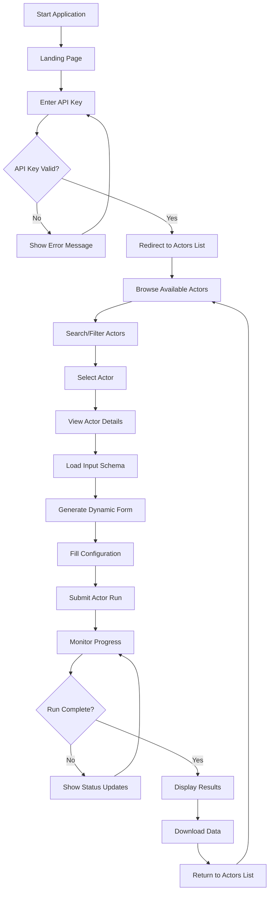

# Apify Integration Web Application

A modern full-stack web application that demonstrates seamless integration with the Apify platform, specifically designed for web scraping automation. The application allows users to authenticate with their Apify API key, browse available actors, configure web scraping parameters through dynamic forms, and execute scraping tasks with real-time monitoring and results visualization.

## 🎯 Primary Use Case: Web Scraping with Apify

This application is specifically optimized for the **Apify Web Scraper** actor, providing an intuitive interface for:

- Configuring web scraping parameters
- Setting up crawling rules and data extraction
- Monitoring scraping progress in real-time
- Downloading and analyzing scraped data

## 🚀 Features

- **Secure Authentication**: Connect using your Apify API key
- **Dynamic Actor Discovery**: Browse all your available actors
- **Runtime Schema Loading**: Automatically fetch and display actor input schemas
- **Interactive Form Generation**: Dynamic forms based on actor schemas
- **Real-time Execution**: Run actors and monitor progress in real-time
- **Results Visualization**: View and download execution results
- **Error Handling**: Comprehensive error handling with user-friendly messages
- **Responsive Design**: Modern, mobile-friendly interface

## 🏗️ Architecture

### Backend (Node.js + Express)

- **ES6 Modules**: Modern JavaScript with import/export syntax
- **MVC Structure**: Organized controllers, services, and routes
- **Security**: Helmet, CORS, rate limiting, input validation
- **Error Handling**: Centralized error handling middleware
- **API Integration**: Secure communication with Apify API
- **RESTful Design**: Clean API endpoints following REST principles

### Frontend (React + Vite)

- **Modern React**: Hooks, Context API, React Router v6
- **Tailwind CSS**: Utility-first styling with custom components
- **Form Handling**: Dynamic form generation from JSON schemas
- **State Management**: Context API for authentication and global state
- **Real-time Updates**: Polling mechanism for run status updates
- **Responsive Design**: Mobile-first approach with breakpoint utilities
- **Component Architecture**: Reusable UI components and layouts

### UI/UX Enhancements

- **Improved Navigation**: Logout button repositioned for better UX
- **Enhanced Spacing**: Optimized card layouts with proper spacing
- **Dynamic Forms**: Schema-driven form generation with validation
- **Loading States**: Comprehensive loading indicators and spinners
- **Error Boundaries**: Graceful error handling with user-friendly messages
- **Toast Notifications**: Real-time feedback for user actions

## 📋 Prerequisites

- Node.js (v18 or higher)
- npm or yarn
- Apify account with API key

## 🛠️ Installation

1. **Clone the repository**

   ```bash
   git clone <repository-url>
   cd E-growth-lab
   ```

2. **Install dependencies for all packages**

   ```bash
   npm run install-all
   ```

3. **Environment Setup**

   The server `.env` file is already configured with default values:

   ```
   PORT=5000
   NODE_ENV=development
   APIFY_API_BASE_URL=https://api.apify.com/v2
   ```

## 🚀 Running the Application

### Development Mode (Recommended)

Run both client and server concurrently:

```bash
npm run dev
```

This will start:

- Backend server on `http://localhost:5000`
- Frontend development server on `http://localhost:5173`

### Individual Services

**Backend only:**

```bash
npm run server
```

**Frontend only:**

```bash
npm run client
```

## 🔄 Application Flow

### Complete User Journey



### Detailed Step-by-Step Flow

#### 1. **Authentication Phase**

- **Landing Page**: Clean interface with API key input
- **Validation**: Real-time API key verification
- **Security**: Secure storage in browser localStorage
- **Error Handling**: Clear feedback for invalid keys

#### 2. **Actor Discovery Phase**

- **Actor List**: Grid view of all available actors
- **Search & Filter**: Find specific actors quickly
- **Actor Cards**: Display key information (name, description, stats)
- **Navigation**: Easy access to actor details

#### 3. **Configuration Phase**

- **Schema Loading**: Fetch actor's input requirements
- **Dynamic Form**: Auto-generate form based on schema
- **Field Validation**: Real-time input validation
- **Help Text**: Contextual guidance for each field

#### 4. **Execution Phase**

- **Run Submission**: Secure API call to start actor
- **Progress Monitoring**: Real-time status updates
- **Error Handling**: Graceful failure management
- **User Feedback**: Loading states and progress indicators

#### 5. **Results Phase**

- **Data Visualization**: Structured display of scraped data
- **Export Options**: Download in multiple formats
- **Run History**: Access to previous executions
- **Performance Metrics**: Execution time and resource usage

## 📱 Usage Guide

### Getting Started

1. **Initial Setup**

   ```bash
   # Clone and install
   git clone <repository-url>
   cd E-growth-lab
   npm run install-all
   npm run dev
   ```

2. **Authentication**

   - Open `http://localhost:5173`
   - Get your API key from [Apify Console](https://console.apify.com/account/integrations)
   - Enter API key and click "Connect to Apify"
   - System validates and stores your credentials

3. **Actor Selection**

   - Browse your available actors in a responsive grid
   - Use search to find specific actors (e.g., "web-scraper")
   - View actor statistics (runs, last modified)
   - Click any actor card to view details

4. **Web Scraping Configuration**

   - **Input Schema**: Review required and optional parameters
   - **Start URLs**: Add websites to scrape
   - **Page Function**: Write or modify JavaScript extraction code
   - **Advanced Settings**: Configure crawling limits, proxies, etc.

5. **Execution & Monitoring**

   - Click "Run Actor" to start scraping
   - Monitor real-time progress updates
   - View status changes (READY → RUNNING → SUCCEEDED)
   - Get notified when scraping completes

6. **Results Management**
   - View scraped data in structured format
   - Download results as JSON, CSV, or Excel
   - Analyze data quality and completeness
   - Access run logs for debugging

## 🕷️ Featured Actor: Apify Web Scraper

This application is primarily designed to work with the **Apify Web Scraper** (`apify/web-scraper`), one of the most versatile and powerful web scraping tools available.

### Web Scraper Capabilities:

- **Multi-URL Scraping**: Process multiple websites simultaneously
- **Custom Data Extraction**: Use CSS selectors and JavaScript functions
- **Pagination Handling**: Automatically follow pagination links
- **Rate Limiting**: Configurable request delays and concurrency
- **Data Export**: Multiple output formats (JSON, CSV, Excel)

### Key Configuration Options:

- **Start URLs**: List of websites to scrape
- **Page Function**: JavaScript code for data extraction
- **Max Requests**: Control crawling limits
- **Proxy Settings**: Rotate IP addresses for large-scale scraping
- **Custom Headers**: Set user agents and other HTTP headers

### Example Use Cases:

1. **E-commerce Price Monitoring**: Track product prices across multiple stores
2. **News Aggregation**: Collect articles from various news websites
3. **Real Estate Data**: Gather property listings and market data
4. **Social Media Monitoring**: Extract public posts and engagement metrics
5. **Competitor Analysis**: Monitor competitor websites for changes

## 🧪 Alternative Actors for Testing

While optimized for Web Scraper, the application also works with:

1. **Google Search Results** (`apify/google-search-scraper`)

   - Easy to test with search queries
   - Returns search results data

2. **Website Content Crawler** (`apify/website-content-crawler`)

   - Crawls website content
   - Good for testing with simple URLs

3. **Instagram Scraper** (`apify/instagram-scraper`)
   - Extract Instagram posts and profiles
   - Requires specific configuration

## 🌐 Web Scraper Workflow Example

### Sample Configuration for E-commerce Price Monitoring

```javascript
// Example Page Function for extracting product data
async function pageFunction(context) {
  const { page, request } = context;

  // Extract product information
  const title = await page.$eval("h1.product-title", (el) =>
    el.textContent.trim()
  );
  const price = await page.$eval(".price", (el) => el.textContent.trim());
  const availability = await page.$eval(".stock-status", (el) =>
    el.textContent.trim()
  );

  return {
    url: request.url,
    title,
    price,
    availability,
    scrapedAt: new Date().toISOString(),
  };
}
```

### Typical Input Configuration:

```json
{
  "startUrls": [
    "https://example-store.com/products/laptop",
    "https://example-store.com/products/phone"
  ],
  "pageFunction": "/* JavaScript extraction code */",
  "maxRequestsPerCrawl": 100,
  "maxConcurrency": 5,
  "requestDelay": 2000
}
```

### Expected Output:

```json
[
  {
    "url": "https://example-store.com/products/laptop",
    "title": "Gaming Laptop Pro",
    "price": "$1,299.99",
    "availability": "In Stock",
    "scrapedAt": "2024-01-15T10:30:00.000Z"
  }
]
```

## 🏗️ Project Structure

```
E-growth-lab/
├── client/                 # React frontend
│   ├── src/
│   │   ├── components/     # Reusable components
│   │   │   ├── Forms/      # Dynamic form components
│   │   │   ├── Layout/     # Layout components
│   │   │   └── UI/         # UI components
│   │   ├── context/        # React context providers
│   │   ├── pages/          # Page components
│   │   ├── services/       # API services
│   │   └── main.jsx        # App entry point
│   ├── package.json
│   └── vite.config.js
├── server/                 # Node.js backend
│   ├── controllers/        # Route controllers
│   ├── middleware/         # Express middleware
│   ├── routes/            # API routes
│   ├── services/          # Business logic
│   ├── .env               # Environment variables
│   ├── package.json
│   └── server.js          # Server entry point
├── package.json           # Root package.json
└── README.md
```

## 🔧 API Endpoints

### Apify Integration

- `GET /api/apify/actors` - List all actors
- `GET /api/apify/actors/:actorId/schema` - Get actor schema
- `POST /api/apify/actors/:actorId/run` - Run an actor
- `GET /api/apify/runs/:runId/status` - Get run status
- `GET /api/apify/runs/:runId/results` - Get run results

### System

- `GET /api/health` - Health check endpoint

## 🎨 Design Decisions

### Technical Choices

1. **ES6 Modules**: Used modern JavaScript modules for better tree-shaking and cleaner imports
2. **MVC Architecture**: Separated concerns with controllers, services, and routes
3. **Dynamic Schema Handling**: Runtime schema fetching ensures compatibility with any actor
4. **Context API**: Lightweight state management for authentication
5. **Tailwind CSS**: Utility-first CSS for rapid UI development

### User Experience

1. **Progressive Disclosure**: Show information as needed to avoid overwhelming users
2. **Real-time Feedback**: Immediate feedback for all user actions
3. **Error Recovery**: Clear error messages with actionable suggestions
4. **Responsive Design**: Works seamlessly on desktop and mobile devices

### Security

1. **API Key Storage**: Stored securely in localStorage with easy logout
2. **Request Validation**: Server-side validation for all API requests
3. **Rate Limiting**: Prevents API abuse
4. **CORS Configuration**: Properly configured for development and production

## 🔒 Security Considerations

- API keys are stored in browser localStorage (consider more secure storage for production)
- All API requests include proper authentication headers
- Rate limiting prevents abuse
- Input validation on both client and server
- CORS properly configured

## 🚀 Production Deployment

For production deployment:

1. **Environment Variables**

   - Set `NODE_ENV=production`
   - Configure proper CORS origins
   - Use environment-specific API URLs

2. **Build Frontend**

   ```bash
   cd client && npm run build
   ```

3. **Serve Static Files**
   - Configure Express to serve built React files
   - Set up proper routing for SPA


## 🆘 Troubleshooting

### Common Issues

1. **API Key Invalid**

   - Verify your API key in Apify Console
   - Ensure the key has proper permissions

2. **CORS Errors**

   - Check if backend is running on port 5000
   - Verify CORS configuration in server.js

3. **Actor Not Found**

   - Ensure the actor exists in your Apify account
   - Check if the actor ID is correct

4. **Run Timeout**
   - Some actors may take longer to complete
   - Check actor logs in Apify Console for details

### Getting Help

- Check the browser console for detailed error messages
- Review server logs for backend issues
- Verify API key permissions in Apify Console
- Ensure all dependencies are properly installed

## 📊 Performance Notes

- The app polls for run status every 3 seconds during execution
- Results are loaded on-demand to avoid unnecessary API calls
- Form validation happens client-side for better UX
- API responses are cached where appropriate

---

## 🆕 Recent Updates & Features

### UI/UX Improvements

- ✅ **Enhanced Header Layout**: Logout button moved to left navigation for better accessibility
- ✅ **Improved Card Spacing**: Better visual separation in actor cards
- ✅ **Schema Display Enhancement**: Improved spacing and typography in input schema section
- ✅ **Responsive Layout**: Top-to-bottom layout for actor detail pages
- ✅ **Visual Hierarchy**: Better font sizes and spacing throughout the application

### Technical Enhancements

- ✅ **Dynamic Form Generation**: Automatic form creation based on actor schemas
- ✅ **Real-time Status Updates**: Live monitoring of scraping progress
- ✅ **Error Handling**: Comprehensive error management with user feedback
- ✅ **API Integration**: Seamless communication with Apify platform
- ✅ **Security Features**: Secure API key handling and validation

### Performance Optimizations

- ✅ **Efficient Polling**: Smart status update mechanism
- ✅ **Lazy Loading**: On-demand data loading for better performance
- ✅ **Caching Strategy**: Optimized API response caching
- ✅ **Bundle Optimization**: Vite-powered fast development and builds

## 🎯 Future Roadmap

### Planned Features

- 🔄 **Run History**: Complete history of all actor executions
- 📊 **Analytics Dashboard**: Usage statistics and performance metrics
- 🔔 **Notifications**: Email/SMS alerts for completed runs
- 📱 **Mobile App**: Native mobile application
- 🤖 **AI Integration**: Smart configuration suggestions
- 📈 **Data Visualization**: Charts and graphs for scraped data


---

Built with ❤️ using React, Node.js, Tailwind CSS, and the Apify platform.


